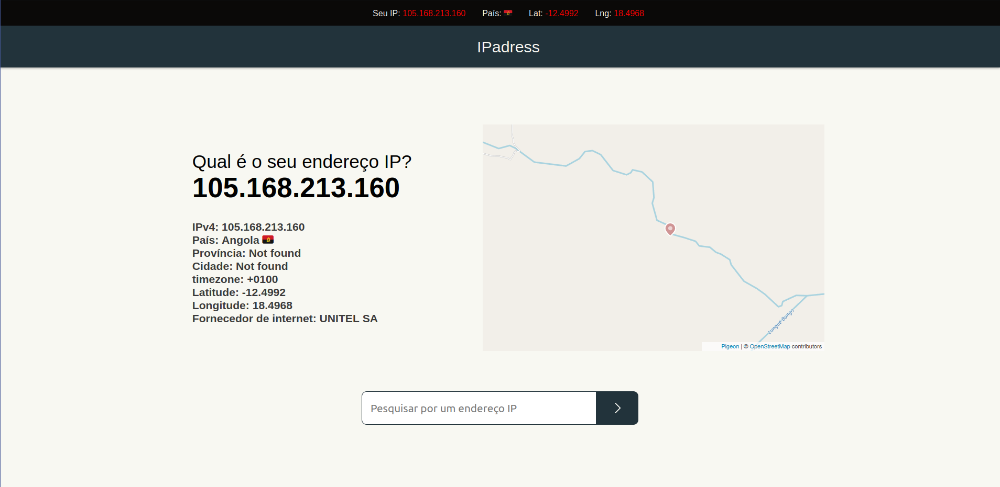

<h1 align="center">Welcome to IPadress 👋🏿</h1>

<p align="center">
    
    &nbsp;&nbsp;
    &nbsp;&nbsp;
    
</p>

<p align="center">
    <a href="#about">About</a>&nbsp;&nbsp;&nbsp;|&nbsp;&nbsp;&nbsp;
    <a href="#installation">Installation</a>&nbsp;&nbsp;&nbsp;|&nbsp;&nbsp;&nbsp;
    <a href="#technology">Technology</a>&nbsp;&nbsp;&nbsp;|&nbsp;&nbsp;&nbsp;
    <a href="#license">License</a>
</p>

<br/><br/>

## <span id="about">👨🏿‍🏫 About</span>
`IPaddres` is an IP locator it tracks any device by the ip address and returns data with the country where this ip address is located the province(state), city, longitude, latitude, ip provider(isp), it is integrated with a map (Google-maps) showing the exact location of this address or device on this web page contains some posts about ip addresses and also some tips about anonymity on the internet.

The base technology for creating this project was the [Next.js](https://reactjs.org/) to develop this project I took about 1 week after some trial and error, This website is fully responsive and can be accessed from any device.<br/>

<br/>

> This project is already hosted on the vercel website and ready to use, to access the web page click [aqui](https://ipadress.vercel.app/).

<br/>

## <span id="preview">✨ Preview</span>

Home page <br/><br/>

<p align="center">
  
</p>

<br/>

## <span id="installation">👨🏿‍💻 Quick Start</span>

To use the website on your local machine follow the steps below:

Cloning the Repository:

```sh
git clone https://github.com/lietsondossanto/ipadress.git
```

Accessing the project folder:

```sh
cd ipadress
```

Install dependeces:

```sh
yarn
```

Execute:

```sh
yarn dev
```

<br />

## <span id="details">⁉️ Details</span>

To create this project I used the `ipdata` API to be able to access data such as longitude, latitude, city etc...

I created an environment variable in an .env file called `API_IPDATA_KEY` that will store my `ipdata` API key

To add this environment variable to the project just create a `.env` file at the root of the project and place the following code inside the `.env` file:
```
NEXT_PUBLIC_API_IPDATA_KEY="<YOUR_KEY>"
```

## <span id="difficulties">😤 Difficulties</span>

While developing this project I had some difficulties creating the front-end and also finding the right APIs to use in this web site.

My biggest difficulty when developing this web page was finding the right APIs, just to develop this web site I had to test an average of 6 APIs which are:

- [React_Leafpad]()
- [Ipify]()
- [Google-maps]()
- [Pigeon]()
- [Ipdata]()
- [IpStack]()

They all had advantages and disadvantages and I always ended up having problems using these APIs.

I also had a little trouble finding the ideal color palette,
the color palette I'm using on this website was drawn from the [coolors](https://coolors.co/) website.

## <span id="technology">🚀 Technologies</span>

This project was developed with the following technologies:

- [Next.js](https://next.org/)
- [Styled-components](https://styled-components.com/)
- [Prettier](https://prettier.io/)
- [EsLint](https://eslint.org/)
- [Nprogress](https://www.npmjs.com/package/nprogress)
- [React-icons](https://react-icons.github.io/react-icons/)
- [Axios](https://github.com/axios/axios)
- [Pigeon Maps](https://pigeon-maps.js.org/)

## <span id="contributing">🤝🏿 Contributing</span>

- Fork this repository;
- Create a branch with your feature: `git checkout -b my-feature`;
- Commit your changes: `git commit -m 'feat: my-new-feature'`;
- Push to your branch: `git push origin my-feature`.

## <span id="author">Author</span>

👤 **Lietson Dos Santos**

- Lindin: [@lietsondossanto](https://www.linkedin.com/in/lietsondossanto)
- Twitter: [@lietsondossanto](https://twitter.com/lietsondossanto)
- Github: [@lietsondossanto](https://github.com/lietsondossanto) <br/>

## <span id="license">📝 License</span>

This project is licensed under the MIT License - see the [LICENSE.md](LICENSE.md) file for details

---

Copyright © 2021-2022 [Lietson Dos Santos](https://github.com/lietsondossanto).
